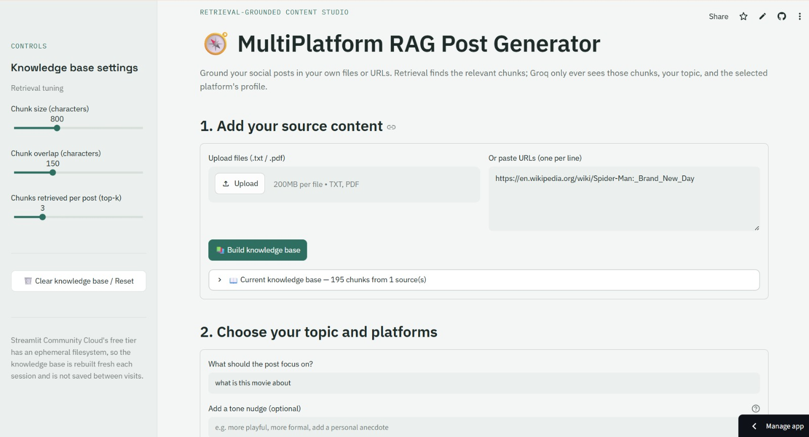
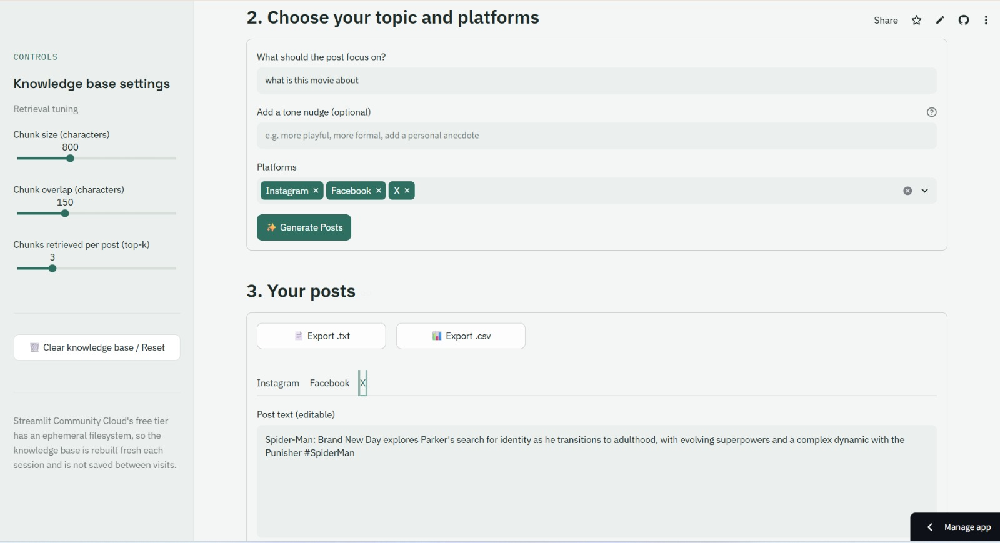
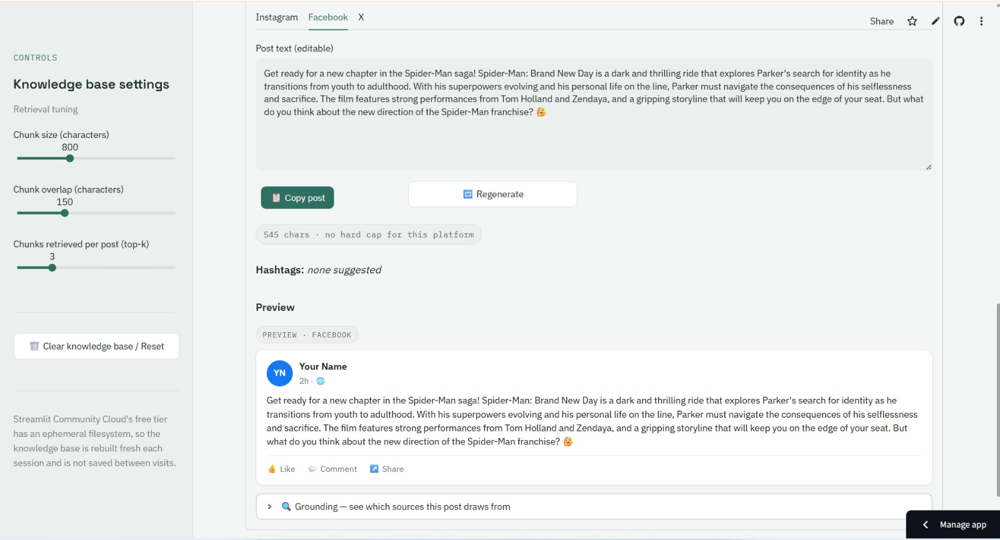
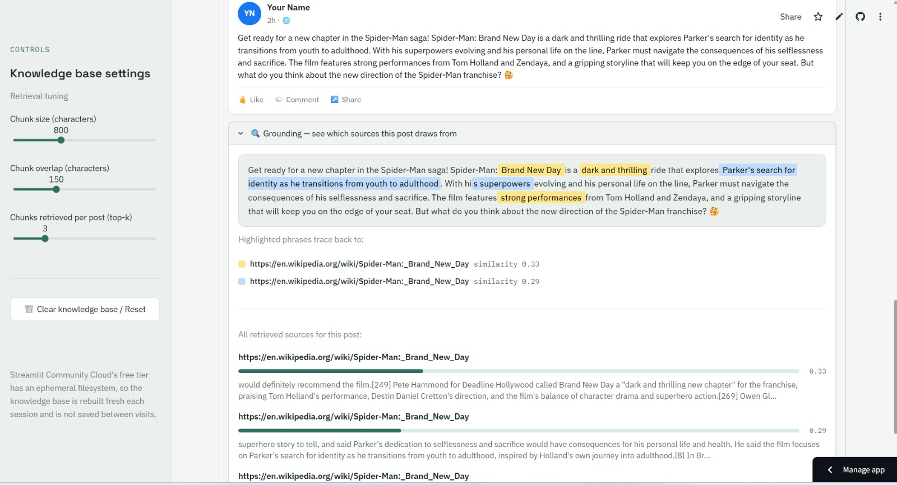

# MultiPlatform RAG Post Generator

Generate platform-tailored social media posts grounded in your own files or URLs, using retrieval-augmented generation (RAG). Upload documents or paste links, pick which platforms you're writing for, and get one tailored post per platform — each backed by the specific passages that were actually retrieved for it.

## How the pipeline works

1. **Ingest** — you upload `.txt`/`.pdf` files and/or paste one or more URLs. Files are read directly; URLs are fetched with `requests` and their main article text is extracted with `trafilatura` (not raw HTML).
2. **Chunk** — each source is split into overlapping text chunks, tagged with the file name or URL it came from.
3. **Embed** — every chunk is embedded locally with a `sentence-transformers` model (`all-MiniLM-L6-v2`). No embedding API, no per-call cost, and it behaves identically wherever it runs.
4. **Index** — the embeddings are L2-normalized and stored in a FAISS `IndexFlatIP` index, which makes inner-product search equivalent to cosine similarity search.
5. **Retrieve** — when you enter a topic/angle and click Generate, the app embeds your topic and retrieves the top-k most relevant chunks from the index.
6. **Generate** — those retrieved chunks, your topic, and the selected platform's tone/length/hashtag profile are sent to Groq (chat completions, JSON object mode). **Groq only ever sees the retrieved chunks — never your whole source document** — plus the topic and the platform profile. This keeps the prompt focused and keeps you in control of exactly what grounding context each post is based on.

If a URL can't be fetched, or a file has no extractable text, the app reports it clearly rather than fabricating a post from nothing.

## Features

- Upload multiple `.txt`/`.pdf` files and/or paste multiple URLs (one per line) as sources
- Local, free embeddings via `sentence-transformers` — no paid embedding API
- FAISS-backed retrieval, rebuilt fresh each session
- One-click generation of tailored posts for any combination of **LinkedIn, Instagram, X, Facebook, Threads**
- Each platform's tone, length, formatting, and hashtag rules are enforced from a single config dict — not just a comment
- Editable, copyable post text per platform, with a live character count and a clear flag if a platform's hard character limit is exceeded
- Expandable "Sources used" section per post, showing exactly which retrieved chunks (and their source) informed that post
- Sidebar controls for chunk size, chunk overlap, and number of chunks retrieved (top-k)
- Graceful error handling for missing API keys, failed URL fetches, and Groq API errors — no crashes, no fabricated output
- A custom "Slate & Sage" visual theme (calm cool-neutral background, muted teal accent, Space Grotesk / IBM Plex type) with retrieval relevance shown as a small filled bar next to each source, instead of a bare decimal score
- **Optional tone nudge** — a free-text field ("more playful", "more formal", etc.) layered on top of each platform's built-in profile, for both the initial generation and any regeneration
- **Per-platform regenerate** — a 🔁 button on each tab reruns just that one platform with a fresh Groq call, leaving the other generated posts untouched
- **Real copy-to-clipboard** — a proper button (not "select all") that copies the current, possibly-edited post text
- **Export all posts** — download everything as a single `.txt` or a `.csv` (platform, post, hashtags, char count, limit status), reflecting your edits, not just the original generation
- **Platform mockup preview** — each post renders inside an approximate LinkedIn/X/Instagram/Facebook/Threads-style card (generic placeholder identity, no real logos/brand marks reproduced) so you can see roughly how it'll read in situ
- **Grounding view** — an expander that highlights phrases in the generated post that trace back near-verbatim to a specific retrieved chunk, color-coded per source with a legend. This is a best-effort visual aid (built with `difflib`, no extra dependencies) — paraphrased content won't highlight, only close textual reuse will

## Demo

| Step | Screenshot |
|---|---|
| 1. Add source content & build the knowledge base | `screenshots/01-build-knowledge-base.png` |
| 2. Choose topic, tone nudge, and platforms | `screenshots/02-choose-topic-platforms.jpeg` |
| 3. Generated post with platform mockup preview | `screenshots/03-platform-preview.jpeg` |
| Grounding view — highlighted source phrases | `screenshots/04-grounding-view.jpeg` |

Click any thumbnail below to open the full-size image.

[](screenshots/01-build-knowledge-base.png)
[](screenshots/02-choose-topic-platforms.jpeg)
[](screenshots/03-platform-preview.jpeg)
[](screenshots/04-grounding-view.jpeg)

## Folder structure

```
.
├── app.py               # The Streamlit app (all pipeline logic + UI)
├── requirements.txt      # Pinned dependencies
├── README.md             # This file
├── screenshots/          # Demo screenshots referenced above (add your own)
└── .streamlit/
    ├── config.toml         # Theme (colors) — safe to commit, no secrets in it
    └── secrets.toml        # Local-only, holds GROQ_API_KEY — never commit this
```

## Local setup

```bash
git clone <your-repo-url>
cd <your-repo-folder>
pip install -r requirements.txt
```

Create a local secrets file (this file is for local development only and should **never** be committed):

```bash
mkdir -p .streamlit
cat > .streamlit/secrets.toml << 'EOF'
GROQ_API_KEY = "your-real-key-here"
EOF
```

Then run the app:

```bash
streamlit run app.py
```

The app will open in your browser at `http://localhost:8501`.

## Deployment — GitHub + Streamlit Community Cloud

1. Create a new GitHub repository and push `app.py`, `requirements.txt`, `README.md`, and `.streamlit/config.toml` to it. `config.toml` only holds the color theme — no secrets — so it's safe to commit.
2. **Do not commit a `secrets.toml` file with a real API key in it.** Add `.streamlit/secrets.toml` to your `.gitignore` if you created one locally for testing.
3. Go to [https://share.streamlit.io](https://share.streamlit.io), sign in with GitHub, click **"New app,"** and select your repository, branch, and `app.py` as the entry point.
4. Before or right after deploying, open the app's **Settings → Secrets** in Streamlit Community Cloud and add:
   ```toml
   GROQ_API_KEY = "your-real-key-here"
   ```
5. Deploy. Streamlit Cloud installs everything from `requirements.txt` automatically — no separate build step on your end.
6. **Know the tradeoff:** Streamlit Community Cloud's free tier sleeps the app after inactivity, and its filesystem is ephemeral, so any FAISS index built during a session is lost on restart. Files and URLs need to be re-ingested each new session unless persistent storage is added later.

## License

MIT License. See below.

```
MIT License

Copyright (c) 2026

Permission is hereby granted, free of charge, to any person obtaining a copy
of this software and associated documentation files (the "Software"), to deal
in the Software without restriction, including without limitation the rights
to use, copy, modify, merge, publish, distribute, sublicense, and/or sell
copies of the Software, and to permit persons to whom the Software is
furnished to do so, subject to the following conditions:

The above copyright notice and this permission notice shall be included in all
copies or substantial portions of the Software.

THE SOFTWARE IS PROVIDED "AS IS", WITHOUT WARRANTY OF ANY KIND, EXPRESS OR
IMPLIED, INCLUDING BUT NOT LIMITED TO THE WARRANTIES OF MERCHANTABILITY,
FITNESS FOR A PARTICULAR PURPOSE AND NONINFRINGEMENT. IN NO EVENT SHALL THE
AUTHORS OR COPYRIGHT HOLDERS BE LIABLE FOR ANY CLAIM, DAMAGES OR OTHER
LIABILITY, WHETHER IN AN ACTION OF CONTRACT, TORT OR OTHERWISE, ARISING FROM,
OUT OF OR IN CONNECTION WITH THE SOFTWARE OR THE USE OR OTHER DEALINGS IN THE
SOFTWARE.
```
